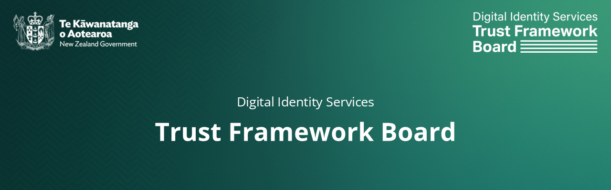

# New Zealand Digital Identity Services Trust Framework Board

The **Trust Framework Board** oversees how New Zealand’s Digital Identity Services Trust Framework works in practice. Its role is to recommend rules and regulations to the Minister, keep them up to date, and provide education and guidance for providers and the public. The Board also monitors how well the framework is working, and can take on other tasks given to it under the law or by the Minister.
